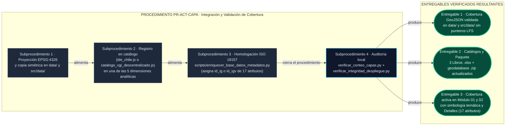
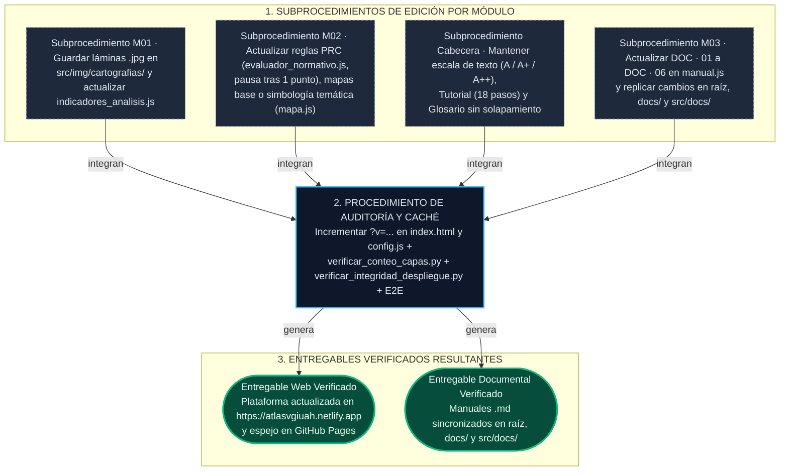

# Guía de contribución y mantención técnica — Atlas para la Gestión Territorial
## Análisis y Exploración | Municipio de Santiago y Barrio Brasil

* **Plataforma Web en Producción:** [https://atlasvgiuah.netlify.app](https://atlasvgiuah.netlify.app)
* **Documentación de Referencia:** [`MANUAL_ACTUALIZACION_ATLAS.md`](MANUAL_ACTUALIZACION_ATLAS.md) · [`docs/ARQUITECTURA.md`](docs/ARQUITECTURA.md) · [`PROTOCOL_INTEGRIDAD_Y_DESPLIEGUE.md`](PROTOCOL_INTEGRIDAD_Y_DESPLIEGUE.md).

---

## 1. Alcance de las contribuciones técnicas

Esta guía establece los procedimientos estandarizados para incorporar nuevas coberturas geográficas —tanto oficiales del Estado de Chile (`id_ig`) como descentralizadas de Información Geográfica Voluntaria (`id_igv`)—, actualizar los 4 guiones visuales y las 83 cartografías del **Módulo 01 (`Análisis`)**, añadir reglas o hitos normativos al **Inspector normativo (PRC)** del **Módulo 02 (`Explorar mapa`)** y mantener los 6 capítulos navegables del **Módulo 03 (`Documentación`)**.

---

## 2. Procedimiento estandarizado para integrar una nueva cobertura (`PR-ACT-CAPA`)

> **Principio de trazabilidad:** Toda etapa técnica ejecutada sobre una cobertura constituye un **subprocedimiento** dentro de **`PR-ACT-CAPA`**, el cual concluye obligatoriamente con la generación de **entregables verificados** en el repositorio y en la plataforma web.


```mermaid
flowchart LR
    classDef subproc fill:#1e293b,stroke:#94a3b8,stroke-dasharray:4 3,color:#e2e8f0
    classDef proc fill:#0f172a,stroke:#38bdf8,stroke-width:2px,color:#e2e8f0
    classDef ent fill:#064e3b,stroke:#10b981,stroke-width:2.5px,color:#ecfdf5

    subgraph PROC["PROCEDIMIENTO PR-ACT-CAPA · Integración y Validación de Cobertura"]
        SP1["Subprocedimiento 1 · Proyección EPSG:4326\ny copia simétrica en data/ y src/data/"]:::subproc
        SP2["Subprocedimiento 2 · Registro en catálogo\n(ide_chile.js o catalogo_vgi_descentralizado.js)\nen una de las 5 dimensiones analíticas"]:::subproc
        SP3["Subprocedimiento 3 · Homologación ISO 19157\nscripts/enriquecer_base_datos_metadatos.py\n(asigna id_ig o id_igv de 17 atributos)"]:::subproc
        SP4["Subprocedimiento 4 · Auditoría local\nverificar_conteo_capas.py +\nverificar_integridad_despliegue.py"]:::proc
    end

    subgraph ENT["ENTREGABLES VERIFICADOS RESULTANTES"]
        E_GEO(["Entregable 1 · Cobertura GeoJSON validada\nen data/ y src/data/ sin punteros LFS"]):::ent
        E_CAT(["Entregable 2 · Catálogos y Paquete\n3 Libros .xlsx + geodatabase .zip actualizados"]):::ent
        E_MOD(["Entregable 3 · Cobertura activa en Módulo 01 y 02\ncon simbología temática y Detalles (17 atributos)"]):::ent
    end

    SP1 -->|"alimenta"| SP2 -->|"alimenta"| SP3 -->|"cierra el procedimiento"| SP4
    SP4 -->|"produce"| E_GEO & E_CAT & E_MOD
```

### Relación de subprocedimientos e entregables resultantes (`PR-ACT-CAPA`):

1. **Subprocedimiento 1 — Normalización geodésica a `EPSG:4326` y copia simétrica en `data/` y `src/data/`:**
   Verifique que el archivo `.geojson` utilice coordenadas geográficas `EPSG:4326` (longitud `[-71,8°, -69,5°]`, latitud `[-34,5°, -32,8°]`) y codificación `UTF-8`, y guárdelo simultáneamente en `data/<id_capa>.geojson` y `src/data/<id_capa>.geojson`. *(Alimenta el Subprocedimiento 2).*
2. **Subprocedimiento 2 — Registro en `ide_chile.js` o `catalogo_vgi_descentralizado.js`:**
   Agregue la definición de la cobertura dentro del catálogo en `src/js/modulos/ide_chile.js` (para capas oficiales `id_ig`) o en `src/js/modulos/catalogo_vgi_descentralizado.js` (para capas colaborativas de IGV `id_igv`) y asóciela a una de las **5 dimensiones analíticas** (*1. Dimensión Sociodemográfica y Habitacional*, *2. Dimensión Socioeconómica y Comercial*, *3. Dimensión Socioambiental y Espacio Público*, *4. Dimensión Sociosanitaria y Salud* o *5. Dimensión Sociourbana, Movilidad y Normativa*):
   ```javascript
   nueva_capa: {
     id: 'nueva_capa',
     nombre: 'Nombre descriptivo de la cobertura',
     institucion: 'Institución pública o comunidad IGV custodia',
     archivoLocal: 'data/nueva_capa.geojson',
     color: '#10b981',
     peso: 2,
     opacidadRelleno: 0.35,
     geometria: 'Polígono', // 'Punto' | 'Línea' | 'Polígono'
     licencia: 'Datos Abiertos (Ley N.° 20.285) / ODbL 1.0',
     descripcion: 'Síntesis técnica de la cobertura y su utilidad territorial.'
   }
   ```
   *(Alimenta el Subprocedimiento 3).*
3. **Subprocedimiento 3 — Inyección del perfil de 17 atributos ISO 19157 (`id_ig` / `id_igv`):**
   Ejecute `python3 scripts/enriquecer_base_datos_metadatos.py` para incorporar las 17 columnas homologadas de metadatos y calidad espacial que se consultan en el panel inferior de **Detalles** del Módulo 02. *(Alimenta el Subprocedimiento 4).*
4. **Subprocedimiento 4 — Auditoría local, regeneración de catálogos y publicación web → Entregables Verificados:**
   Ejecute `python3 scripts/verificar_conteo_capas.py` y `python3 scripts/verificar_integridad_despliegue.py` (y, si corresponde regenerar inventarios, `scripts/generar_catalogos_excel.py`). **Entregables verificados resultantes:** cobertura `.geojson` íntegra y homologada en `data/` y `src/data/`, libros `.xlsx` sincronizados y capa operativa con simbología temática y ficha de 17 atributos en producción.

---

## 3. Procedimiento integral para actualizar los 3 módulos de la plataforma (`PR-ACT-MOD`)

Cada subprocedimiento de edición en código o documentación converge en el procedimiento de control de versión y auditoría para emitir entregables verificados en producción:


```mermaid
flowchart TD
    classDef subproc fill:#1e293b,stroke:#94a3b8,stroke-dasharray:4 3,color:#e2e8f0
    classDef proc fill:#0f172a,stroke:#38bdf8,stroke-width:2px,color:#e2e8f0
    classDef ent fill:#064e3b,stroke:#10b981,stroke-width:2.5px,color:#ecfdf5

    subgraph SUBPROCS["1. SUBPROCEDIMIENTOS DE EDICIÓN POR MÓDULO"]
        SB1["Subprocedimiento M01 · Guardar láminas .jpg en\nsrc/img/cartografias/ y actualizar indicadores_analisis.js"]:::subproc
        MP1["Subprocedimiento M02 · Actualizar reglas PRC (evaluador_normativo.js,\npausa tras 1 punto), mapas base o simbología temática (mapa.js)"]:::subproc
        UI1["Subprocedimiento Cabecera · Mantener escala de texto (A / A+ / A++),\nTutorial (18 pasos) y Glosario sin solapamiento"]:::subproc
        DOC1["Subprocedimiento M03 · Actualizar DOC · 01 a DOC · 06 en manual.js\ny replicar cambios en raíz, docs/ y src/docs/"]:::subproc
    end

    PR_VER["2. PROCEDIMIENTO DE AUDITORÍA Y CACHÉ\nIncrementar ?v=... en index.html y config.js +\nverificar_conteo_capas.py + verificar_integridad_despliegue.py + E2E"]:::proc

    subgraph ENT["3. ENTREGABLES VERIFICADOS RESULTANTES"]
        E_WEB(["Entregable Web Verificado\nPlataforma actualizada en https://atlasvgiuah.netlify.app\ny espejo en GitHub Pages"]):::ent
        E_DOC(["Entregable Documental Verificado\nManuales .md sincronizados en raíz, docs/ y src/docs/"]):::ent
    end

    SB1 & MP1 & UI1 & DOC1 -->|"integran"| PR_VER
    PR_VER -->|"genera"| E_WEB & E_DOC
```

---

## 4. Convenciones de organización y estilo documental

1. **JavaScript Modular:**
   * Mantener cada componente funcional separado en su archivo correspondiente dentro de `src/js/modulos/`.
   * Manejar posibles errores de red en peticiones de carga de capas leyendo desde `src/data/`.
2. **Coherencia terminológica en español:**
   * Utilizar el título oficial único **Atlas para la Gestión Territorial** y el subtítulo **Análisis y Exploración | Municipio de Santiago y Barrio Brasil**.
   * Emplear la sigla en español **IGV** (Información Geográfica Voluntaria) para referirse a las 171 coberturas colaborativas descentralizadas (`id_igv`) e **IG** para las 123 coberturas oficiales del Estado (`id_ig`).
3. **Flujo de commits semánticos:**
   * Utilizar prefijos claros: `feat(modulo): ...`, `fix(visor): ...`, `docs(manual): ...`, `data(capas): ...`.
