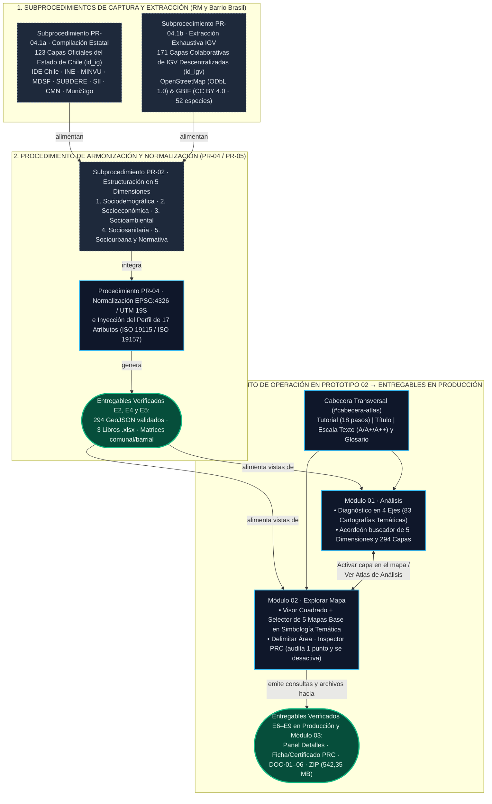
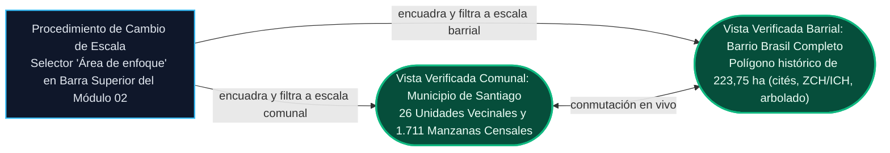
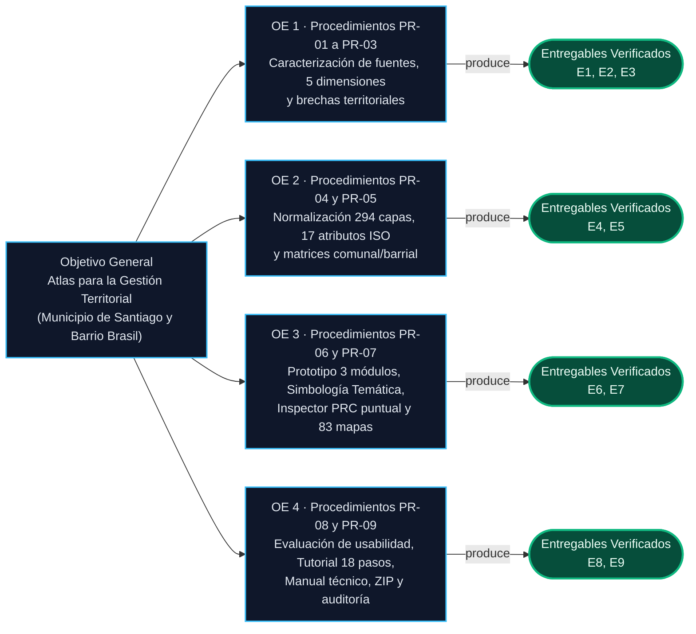
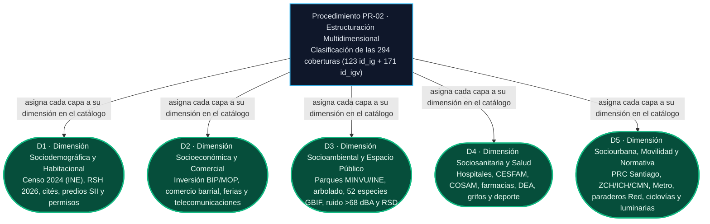
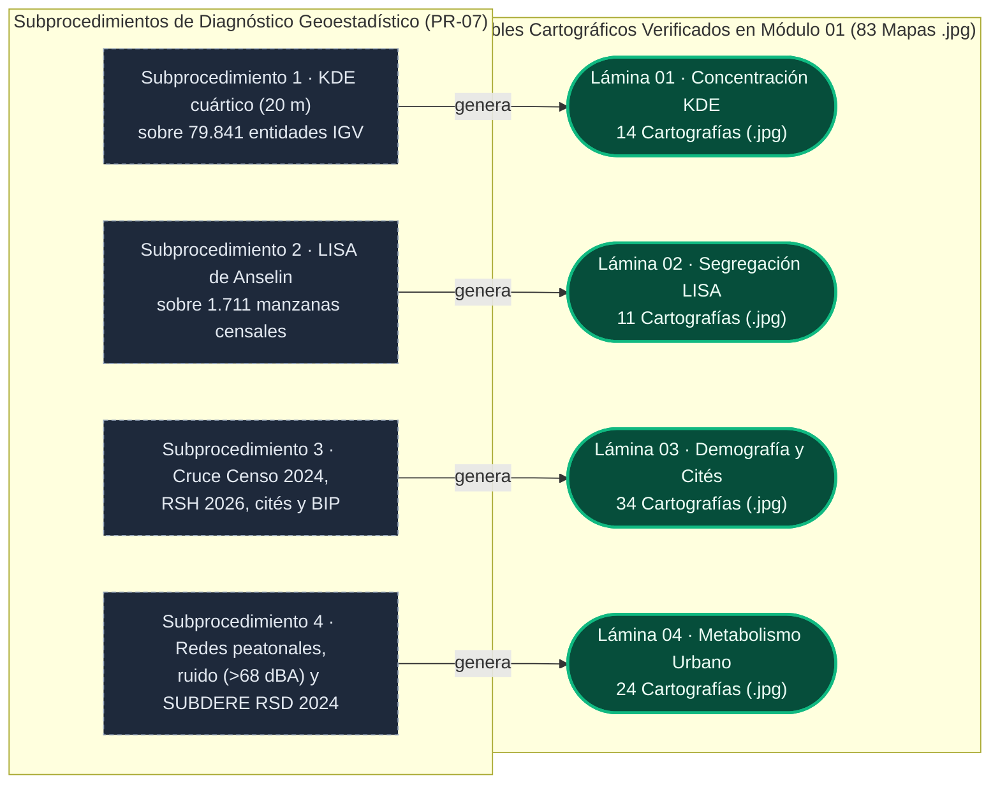

# Atlas para la Gestión Territorial
## Análisis y Exploración | Municipio de Santiago y Barrio Brasil — Manual de Actualización, Estructura de Datos y Funcionamiento de la Plataforma (Prototipo 02)

* **Plataforma Web en Producción:** [https://atlasvgiuah.netlify.app](https://atlasvgiuah.netlify.app)
* **Repositorio Espejo (GitHub Pages):** [https://geojota.github.io/atlas-vgi-barrio-brasil/](https://geojota.github.io/atlas-vgi-barrio-brasil/)
* **Geodatabase Consolidada Descargable (`.zip`):** `docs/geodatabase_completa_atlas_vgi.zip` (`542,35 MB` comprimidos / `~3,33 GB` descomprimidos; `294` coberturas espaciales operativas).

---

## Índice General de Contenidos

### [PARTE I: Alcance Operativo, Formulación Estratégica, Procedimientos, Hitos Verificados y Perfiles Territoriales](#parte-i-alcance-operativo-formulación-estratégica-procedimientos-hitos-verificados-y-perfiles-territoriales)
* [1. Identificación, propósito y visión general del Prototipo 02](#1-identificación-propósito-y-visión-general-del-prototipo-02)
  * [1.1. Un prototipo sintetizado para facilitar la gestión y lectura del territorio](#11-un-prototipo-sintetizado-para-facilitar-la-gestión-y-lectura-del-territorio)
  * [1.2. Tabla 1.1: Cifras clave verificadas del proyecto (referencia única)](#12-tabla-11-cifras-clave-verificadas-del-proyecto-referencia-única)
  * [1.3. Diagrama general de procedimientos e entregables en los 3 módulos](#13-diagrama-general-de-procedimientos-e-entregables-en-los-3-módulos)
* [2. Cobertura territorial y escalas de trabajo del Atlas](#2-cobertura-territorial-y-escalas-de-trabajo-del-atlas)
  * [2.1. Articulación entre la escala comunal (Municipio de Santiago) y la escala barrial (Barrio Brasil)](#21-articulación-entre-la-escala-comunal-municipio-de-santiago-y-la-escala-barrial-barrio-brasil)
* [3. Formulación estratégica: Objetivos, procedimientos y entregables verificados (Eje Rector)](#3-formulación-estratégica-objetivos-procedimientos-y-entregables-verificados-eje-rector)
  * [3.1. Objetivo general](#31-objetivo-general)
  * [3.2. Objetivos específicos (`OE 1` a `OE 4`), procedimientos (`PR`) y entregables verificados (`E1`–`E9`)](#32-objetivos-específicos-oe-1-a-oe-4-procedimientos-pr-y-entregables-verificados-e1e9)
  * [3.3. Tabla sinóptica de articulación: Procedimiento → Entregable Verificado](#33-tabla-sinóptica-de-articulación-procedimiento--entregable-verificado)
* [4. Matriz de los 9 Hitos: Procedimientos (`PR-01`–`PR-09`) y Entregables Verificados (`E1`–`E9`)](#4-matriz-de-los-9-hitos-procedimientos-pr-01pr-09-y-entregables-verificados-e1e9)
* [5. Perfiles de actores territoriales destinatarios](#5-perfiles-de-actores-territoriales-destinatarios)

### [PARTE II: Organización de las 5 Dimensiones Analíticas, Catálogo de 294 Capas, Diagnóstico Territorial y Actualización](#parte-ii-organización-de-las-5-dimensiones-analíticas-catálogo-de-294-capas-diagnóstico-territorial-y-actualización)
* [6. Organización temática en las 5 Dimensiones Analíticas del Territorio](#6-organización-temática-en-las-5-dimensiones-analíticas-del-territorio)
  * [6.1. Dimensión 1: Sociodemográfica y Habitacional](#61-dimensión-1-sociodemográfica-y-habitacional)
  * [6.2. Dimensión 2: Socioeconómica y Comercial](#62-dimensión-2-socioeconómica-y-comercial)
  * [6.3. Dimensión 3: Socioambiental y Espacio Público](#63-dimensión-3-socioambiental-y-espacio-público)
  * [6.4. Dimensión 4: Sociosanitaria y Salud](#64-dimensión-4-sociosanitaria-y-salud)
  * [6.5. Dimensión 5: Sociourbana, Movilidad y Normativa](#65-dimensión-5-sociourbana-movilidad-y-normativa)
* [7. Descentralización de las 171 coberturas de Información Geográfica Voluntaria (`id_igv`)](#7-descentralización-de-las-171-coberturas-de-información-geográfica-voluntaria-id_igv)
* [8. Integración de las 123 capas oficiales del Estado de Chile (`id_ig`)](#8-integración-de-las-123-capas-oficiales-del-estado-de-chile-id_ig)
* [9. Perfil homologado de 17 atributos de metadatos y calidad (ISO 19115 / ISO 19157)](#9-perfil-homologado-de-17-atributos-de-metadatos-y-calidad-iso-19115--iso-19157)
  * [9.1. Diccionario de los 17 atributos homologados (`id_ig` / `id_igv`)](#91-diccionario-de-los-17-atributos-homologados-id_ig--id_igv)
  * [9.2. Libros maestros descargables en formato Excel (`.xlsx`)](#92-libros-maestros-descargables-en-formato-excel-xlsx)
* [10. Guía comprensible de los 4 Ejes de Diagnóstico Geoestadístico (83 cartografías)](#10-guía-comprensible-de-los-4-ejes-de-diagnóstico-geoestadístico-83-cartografías)
  * [10.1. Eje 01: Concentración Territorial de Actividad IGV en Santiago (14 mapas KDE)](#101-eje-01-concentración-territorial-de-actividad-igv-en-santiago-14-mapas-kde)
  * [10.2. Eje 02: Segregación Espacial, Hotspots y Áreas de Rezago (11 mapas LISA)](#102-eje-02-segregación-espacial-hotspots-y-áreas-de-rezago-11-mapas-lisa)
  * [10.3. Eje 03: Estructura Sociodemográfica, Habitabilidad y Morfología Urbana (34 mapas)](#103-eje-03-estructura-sociodemográfica-habitabilidad-y-morfología-urbana-34-mapas)
  * [10.4. Eje 04: Metabolismo Urbano, Movilidad y Espacio Público (24 mapas)](#104-eje-04-metabolismo-urbano-movilidad-y-espacio-público-24-mapas)
* [11. Procedimientos de actualización, entregables verificados y catálogo del repositorio](#11-procedimientos-de-actualización-entregables-verificados-y-catálogo-del-repositorio)
  * [11.1. Catálogo descriptivo de todos los archivos del repositorio y de la plataforma](#111-catálogo-descriptivo-de-todos-los-archivos-del-repositorio-y-de-la-plataforma)

---

# PARTE I: Alcance Operativo, Formulación Estratégica, Procedimientos, Hitos Verificados y Perfiles Territoriales

---

## 1. Identificación, propósito y visión general del Prototipo 02

El **Atlas para la Gestión Territorial** (*Análisis y Exploración | Municipio de Santiago y Barrio Brasil*) es una plataforma web pública y abierta que integra en un mismo entorno **123 coberturas oficiales del Estado de Chile** (identificadas con el atributo primario `id_ig`) y **171 coberturas descentralizadas de Información Geográfica Voluntaria, IGV** (identificadas con el atributo primario `id_igv`).

Su objetivo principal es acercar la información territorial tanto a quienes toman decisiones en instituciones públicas como a las comunidades barriales, mapeadores voluntarios e investigadores, combinando la validez estadística y normativa de los registros del Estado con el nivel de detalle cotidiano que aporta la cartografía colaborativa.

### 1.1. Un prototipo sintetizado para facilitar la gestión y lectura del territorio
A partir de la evaluación de usabilidad desarrollada en el proyecto, el **Prototipo 02** organiza todas las capacidades del Atlas en una estructura limpia, directa y fácil de recorrer compuesta por **tres módulos principales**, tipografía escalable adaptativa y **dos herramientas de apoyo permanente en la cabecera**:
* **Cabecera Superior Permanente (`#cabecera-atlas`):** Ubica el **Tutorial Interactivo** (de 18 pasos organizados en 4 bloques navegables) a la izquierda del título principal, y el **control dinámico de tamaño de letra (`A` / `A+` / `A++`)** junto al **Glosario de siglas** a la derecha del título, asegurando una lectura cómoda sin superposiciones.
* **Módulo 01 · Análisis (`#panel-indicadores`):** Presenta el diagnóstico del territorio a través de **4 láminas geoestadísticas (83 cartografías temáticas)** y agrupa las **294 coberturas** en **5 Dimensiones Analíticas** con un buscador en español que permite activarlas directamente en el mapa.
* **Módulo 02 · Explorar Mapa (`#panel-inicio`):** Dispone un visor cartográfico amplio y de proporción cuadrada con **5 mapas base abiertos y satelitales sin requerimiento de clave de API** (OpenStreetMap Estándar, OpenStreetMap Humanitario HOT, Imagen Satelital Bing/Microsoft, Satelital Híbrido con Calles Bing/Microsoft e Imagen Satelital Esri World Imagery), conmutables tanto en el control del mapa como directamente desde el panel **Simbología Dinámica**; barra superior centrada de herramientas; motor de **Simbología Temática**; **Inspector normativo del Plan Regulador Comunal (PRC)** bajo demanda (que audita un punto y desactiva la captura automáticamente hasta una nueva solicitud); y el panel inferior **Detalles** para consultar los **17 atributos homologados (`id_ig` / `id_igv`)**.
* **Módulo 03 · Documentación (`#panel-manual`):** Reúne dentro de la plataforma **6 capítulos navegables (`DOC · 01` a `DOC · 06`)** con buscador en tiempo real, descargas de los 3 libros en formato Excel (`.xlsx`), manuales, el paquete comprimido de la geodatabase completa (`.zip` de `542,35 MB`) y el inventario filtrable de las 294 capas.

### 1.2. Tabla 1.1: Cifras clave verificadas del proyecto (referencia única)

| Componente del sistema | Valor verificado | Descripción clara y alcance |
| :--- | :---: | :--- |
| **Total de coberturas cartográficas** | **294 capas** | Suma de **123 capas oficiales del Estado de Chile (`id_ig`)** y **171 coberturas descentralizadas de Información Geográfica Voluntaria (`id_igv`)** con extracción exhaustiva para RM y Barrio Brasil. |
| **Dimensiones Analíticas del territorio** | **5 dimensiones** | (1) *Sociodemográfica y Habitacional*, (2) *Socioeconómica y Comercial*, (3) *Socioambiental y Espacio Público*, (4) *Sociosanitaria y Salud*, y (5) *Sociourbana, Movilidad y Normativa*. |
| **Diagnóstico geoestadístico** | **4 ejes · 83 cartografías** | Lámina 01: Concentración KDE (`14` mapas); Lámina 02: Autocorrelación LISA (`11` mapas); Lámina 03: Demografía Censo 2024, RSH y cités (`34` mapas); Lámina 04: Metabolismo urbano, ruido y residuos (`24` mapas). |
| **Perfil homologado de metadatos y calidad** | **17 atributos por entidad** | Estandarizado bajo normas **ISO 19115** e **ISO 19157**, diferenciando `id_ig` (fuente oficial) e `id_igv` (fuente voluntaria), visible en el panel inferior **Detalles** del Módulo 02. |
| **Estructura de navegación y accesibilidad** | **3 módulos + ayudas en cabecera** | `Módulo 01 · Análisis`, `Módulo 02 · Explorar Mapa` y `Módulo 03 · Documentación` (6 capítulos), más ajuste de letra (`A` / `A+` / `A++`), **Tutorial Interactivo** (18 pasos) y **Glosario de siglas**. |
| **Mapas base disponibles** | **5 mapas base sin API** | *OpenStreetMap Estándar*, *OpenStreetMap Humanitario (HOT)*, *Imagen Satelital (Bing / Microsoft)*, *Satelital Híbrido con Calles (Bing / Microsoft)* e *Imagen Satelital (Esri World Imagery)*, conmutables también en *Simbología Dinámica*. |
| **Hitos con entregable verificado** | **9 procedimientos → 9 hitos (`E1` a `E9`)** | Cadena continua donde cada procedimiento principal genera un entregable verificado en el repositorio y en la plataforma web. |
| **Paquete maestro descargable** | **542,35 MB (`.zip`)** | Archivo `docs/geodatabase_completa_atlas_vgi.zip` acompañado de 3 libros maestros en formato Excel (`.xlsx`). |

### 1.3. Diagrama general de procedimientos e entregables en los 3 módulos

```mermaid
flowchart TB
    classDef subproc fill:#1e293b,stroke:#94a3b8,stroke-dasharray:4 3,color:#e2e8f0
    classDef proc fill:#0f172a,stroke:#38bdf8,stroke-width:2px,color:#e2e8f0
    classDef ent fill:#064e3b,stroke:#10b981,stroke-width:2.5px,color:#ecfdf5

    subgraph FUENTES["1. SUBPROCEDIMIENTOS DE CAPTURA Y EXTRACCIÓN (RM y Barrio Brasil)"]
        FO["Subprocedimiento PR-04.1a · Compilación Estatal\n123 Capas Oficiales del Estado de Chile (id_ig)\nIDE Chile · INE · MINVU · MDSF · SUBDERE · SII · CMN · MuniStgo"]:::subproc
        FV["Subprocedimiento PR-04.1b · Extracción Exhaustiva IGV\n171 Capas Colaborativas de IGV Descentralizadas (id_igv)\nOpenStreetMap (ODbL 1.0) & GBIF (CC BY 4.0 · 52 especies)"]:::subproc
    end

    subgraph ARMONIZACION["2. PROCEDIMIENTO DE ARMONIZACIÓN Y NORMALIZACIÓN (PR-04 / PR-05)"]
        DIM["Subprocedimiento PR-02 · Estructuración en 5 Dimensiones\n1. Sociodemográfica · 2. Socioeconómica · 3. Socioambiental\n4. Sociosanitaria · 5. Sociourbana y Normativa"]:::subproc
        ATR["Procedimiento PR-04 · Normalización EPSG:4326 / UTM 19S\ne Inyección del Perfil de 17 Atributos (ISO 19115 / ISO 19157)"]:::proc
        ENT_DAT(["Entregables Verificados E2, E4 y E5:\n294 GeoJSON validados · 3 Libros .xlsx · Matrices comunal/barrial"]):::ent
    end

    subgraph PLATAFORMA["3. PROCEDIMIENTO DE OPERACIÓN EN PROTOTIPO 02 → ENTREGABLES EN PRODUCCIÓN"]
        CAB["Cabecera Transversal (#cabecera-atlas)\nTutorial (18 pasos) | Título | Escala Texto (A/A+/A++) y Glosario"]:::proc
        M01["Módulo 01 · Análisis\n• Diagnóstico en 4 Ejes (83 Cartografías Temáticas)\n• Acordeón buscador de 5 Dimensiones y 294 Capas"]:::proc
        M02["Módulo 02 · Explorar Mapa\n• Visor Cuadrado + Selector de 5 Mapas Base en Simbología Temática\n• Delimitar Área · Inspector PRC (audita 1 punto y se desactiva)"]:::proc
        M03(["Entregables Verificados E6–E9 en Producción y Módulo 03:\nPanel Detalles · Ficha/Certificado PRC · DOC·01–06 · ZIP (542,35 MB)"]):::ent
    end

    FO & FV -->|"alimentan"| DIM -->|"integra"| ATR -->|"genera"| ENT_DAT
    ENT_DAT -->|"alimenta vistas de"| M01 & M02
    CAB --> M01 & M02
    M01 <-->|"Activar capa en el mapa /\nVer Atlas de Análisis"| M02
    M02 -->|"emite consultas y archivos hacia"| M03
```

---

## 2. Cobertura territorial y escalas de trabajo del Atlas

### 2.1. Articulación entre la escala comunal (Municipio de Santiago) y la escala barrial (Barrio Brasil)
El Atlas permite trabajar de forma fluida en dos escalas complementarias, conmutables desde el selector **Área de enfoque** en la barra superior del **Módulo 02 (`Explorar Mapa`)**:
1. **Escala Comunal — Municipio de Santiago (`1.711` manzanas censales y `26` unidades vecinales):** Abarca toda la comuna de Santiago, permitiendo observar patrones generales de población, distribución de equipamientos, redes de movilidad y zonas de gestión ambiental.
2. **Escala Barrial — Barrio Brasil (`223,75 ha` en el sector norponiente):** Comprende el polígono delimitado por Av. San Pablo/Rosas al norte, la Alameda al sur, Av. Manuel Rodríguez (Ruta 5) al oriente y Av. Ricardo Cumming/García Reyes al poniente, facilitando el análisis detallado a nivel de cuadra, pasaje, cité y predio patrimonial.

```mermaid
flowchart LR
    classDef proc fill:#0f172a,stroke:#38bdf8,stroke-width:1.8px,color:#e2e8f0
    classDef ent fill:#064e3b,stroke:#10b981,stroke-width:2.5px,color:#ecfdf5

    SEL["Procedimiento de Cambio de Escala\nSelector 'Área de enfoque' en Barra Superior del Módulo 02"]:::proc
    COM(["Vista Verificada Comunal: Municipio de Santiago\n26 Unidades Vecinales y 1.711 Manzanas Censales"]):::ent
    BAR(["Vista Verificada Barrial: Barrio Brasil Completo\nPolígono histórico de 223,75 ha (cités, ZCH/ICH, arbolado)"]):::ent

    SEL -->|"encuadra y filtra a escala comunal"| COM
    SEL -->|"encuadra y filtra a escala barrial"| BAR
    COM <-->|"conmutación en vivo"| BAR
```

---

## 3. Formulación estratégica: Objetivos, procedimientos y entregables verificados (Eje Rector)

La formulación estratégica constituye el **eje rector** que define la arquitectura, el diseño de datos, las herramientas del geoportal y las pautas de validación del Atlas. Para evitar toda ambigüedad entre actividades técnicas y resultados concretos, el proyecto aplica una regla estricta de correspondencia: **cada objetivo específico se ejecuta mediante procedimientos codificados (`PR-01` a `PR-09`) —integrados por subprocedimientos explícitos cuando corresponde— y todo procedimiento culmina necesariamente en un entregable verificado (`E1` a `E9`) en el repositorio y la plataforma web**.

```mermaid
flowchart LR
    classDef proc fill:#0f172a,stroke:#38bdf8,stroke-width:1.8px,color:#e2e8f0
    classDef ent fill:#064e3b,stroke:#10b981,stroke-width:2.5px,color:#ecfdf5

    OG["Objetivo General\nAtlas para la Gestión Territorial\n(Municipio de Santiago y Barrio Brasil)"]:::proc

    OE1["OE 1 · Procedimientos PR-01 a PR-03\nCaracterización de fuentes, 5 dimensiones\ny brechas territoriales"]:::proc
    E13(["Entregables Verificados\nE1, E2, E3"]):::ent

    OE2["OE 2 · Procedimientos PR-04 y PR-05\nNormalización 294 capas, 17 atributos ISO\ny matrices comunal/barrial"]:::proc
    E45(["Entregables Verificados\nE4, E5"]):::ent

    OE3["OE 3 · Procedimientos PR-06 y PR-07\nPrototipo 3 módulos, Simbología Temática,\nInspector PRC puntual y 83 mapas"]:::proc
    E67(["Entregables Verificados\nE6, E7"]):::ent

    OE4["OE 4 · Procedimientos PR-08 y PR-09\nEvaluación de usabilidad, Tutorial 18 pasos,\nManual técnico, ZIP y auditoría"]:::proc
    E89(["Entregables Verificados\nE8, E9"]):::ent

    OG --> OE1 & OE2 & OE3 & OE4
    OE1 -->|"produce"| E13
    OE2 -->|"produce"| E45
    OE3 -->|"produce"| E67
    OE4 -->|"produce"| E89
```

### 3.1. Objetivo general

> **Desarrollar un Atlas para la Gestión Territorial reproducible, interoperable y centrado en el usuario, que integre geodatos abiertos, cartografía participativa y herramientas analíticas para subsanar vacíos de información territorial y apoyar la gestión local y la investigación en la Comuna de Santiago y Barrio Brasil.**

---

### 3.2. Objetivos específicos (`OE 1` a `OE 4`), procedimientos (`PR`) y entregables verificados (`E1`–`E9`)

#### **OE 1. Caracterizar la disponibilidad, la cobertura y los vacíos de información geográfica del área de estudio, y definir las bases taxonómicas y de diseño centrado en el usuario que permitan integrar datos colaborativos e institucionales.**
* **Procedimientos ejecutados (`PR-01`, `PR-02` y `PR-03`):**
  * **`PR-01` (Relevamiento de fuentes y arquitectura):** Subprocedimiento de revisión sistemática de plataformas de geodatos abiertos (OpenStreetMap, GBIF e IDE Chile) y diseño de la arquitectura web de la plataforma → genera **`E1`**.
  * **`PR-02` (Taxonomía multidimensional y diseño territorial):** Subprocedimiento de agrupación del catálogo en las **5 Dimensiones Analíticas** (*Sociodemográfica y Habitacional*, *Socioeconómica y Comercial*, *Socioambiental y Espacio Público*, *Sociosanitaria y Salud*, y *Sociourbana, Movilidad y Normativa*) y definición de parámetros de encuadre → genera **`E2`**.
  * **`PR-03` (Caracterización de actores y matriz de brechas):** Subprocedimiento de levantamiento de requerimientos para los cuatro perfiles de actores territoriales y diagnóstico comparativo de cobertura entre fuentes estatales y comunitarias → genera **`E3`**.
* **Entregables verificados resultantes (`E1`, `E2`, `E3`):**
  * **`E1` · Arquitectura del sistema y catálogo inicial:** [`docs/ARQUITECTURA.md`](ARQUITECTURA.md) y [`docs/catalogo_fuentes_vgi.xlsx`](catalogo_fuentes_vgi.xlsx).
  * **`E2` · Taxonomía de 5 dimensiones y configuración territorial:** [`docs/categorias_tematicas_osm.xlsx`](categorias_tematicas_osm.xlsx) y [`src/js/config.js`](../js/config.js).
  * **`E3` · Inventario consolidado de 294 fuentes y matriz de brechas:** [`docs/catalogo_fuentes_vgi.xlsx`](catalogo_fuentes_vgi.xlsx) y [`docs/TRAZABILIDAD.md`](TRAZABILIDAD.md) (con réplica idéntica en `src/docs/`).

#### **OE 2. Consolidar una geodatabase multipropósito que armonice coberturas oficiales e información voluntaria bajo estándares internacionales de calidad y metadatos.**
* **Procedimientos ejecutados (`PR-04` y `PR-05`):**
  * **`PR-04` (Descarga exhaustiva, descentralización y homologación ISO 19115 / ISO 19157):** Integrado por dos subprocedimientos encadenados: (`PR-04.1`) extracción exhaustiva para la Región Metropolitana y Barrio Brasil y descentralización en **294 coberturas vectoriales** (**123 capas oficiales** + **171 coberturas IGV**) en `EPSG:4326` (WGS 84) y `EPSG:32719` (SIRGAS-Chile UTM 19S); y (`PR-04.2`) ejecución de `scripts/enriquecer_base_datos_metadatos.py` para homologar el perfil de **17 atributos** diferenciando **`id_ig`** (oficial) e **`id_igv`** (voluntaria) → genera **`E4`**.
  * **`PR-05` (Integración y modelamiento de matrices comunales y barriales):** Cruce espacial de Censo 2024 sobre las 1.711 manzanas, calificación RSH, catastro colaborativo IGV e iniciativas de inversión pública (BIP) en Santiago y Barrio Brasil → genera **`E5`**.
* **Entregables verificados resultantes (`E4`, `E5`):**
  * **`E4` · Geodatabase multipropósito de 294 capas y perfil ISO:** `src/data/*.geojson` (294 archivos), `data/*.geojson`, [`docs/perfil_metadatos_vgi.xlsx`](perfil_metadatos_vgi.xlsx) y `scripts/db/01_schema_postgis.sql`.
  * **`E5` · Matrices de síntesis comunal y barrial:** `data/matriz_sintesis_barrio_brasil_manzanas.geojson`, `data/resumen_catastro_vgi.csv` y `data/bip_inversiones_santiago.csv`.

#### **OE 3. Implementar un geoportal web accesible e interoperable que permita visualizar cartografía multinivel, consultar el territorio en tiempo real y descargar geodatos abiertos.**
* **Procedimientos ejecutados (`PR-06` y `PR-07`):**
  * **`PR-06` (Diseño e implementación del prototipo sintetizado en 3 módulos):** Definición y programación de una interfaz simplificada para usuarios no técnicos articulada en 3 módulos (*Módulo 01 Análisis*, *Módulo 02 Explorar Mapa* y *Módulo 03 Documentación*), control dinámico de tamaño de letra (`A` / `A+` / `A++`) y visor cartográfico cuadrado con **5 mapas base abiertos y satelitales sin clave de API** (*OpenStreetMap Estándar*, *OpenStreetMap Humanitario HOT*, *Imagen Satelital Bing/Microsoft*, *Satelital Híbrido con Calles Bing/Microsoft* e *Imagen Satelital Esri World Imagery*) → genera **`E6`**.
  * **`PR-07` (Implementación de motores analíticos, simbología temática, Inspector PRC y despliegue):** Programación del motor de **simbología temática** (*Color Único*, *Categorizado* y *Graduado* mediante Cuartiles, Cortes Naturales de Jenks, Intervalos Iguales y *Pretty Breaks*) con selector de mapa base integrado; implementación del **Inspector normativo del Plan Regulador Comunal (PRC)** bajo demanda (que audita un punto seleccionado y desactiva la captura automática tras emitir la ficha); desarrollo del panel inferior **Detalles** con los 17 atributos; y compilación de los **4 ejes de diagnóstico geoestadístico con 83 cartografías temáticas** más publicación en Netlify → genera **`E7`**.
* **Entregables verificados resultantes (`E6`, `E7`):**
  * **`E6` · Plataforma sintetizada en 3 módulos y visor base:** [`src/index.html`](../index.html), [`src/css/estilos.css`](../css/estilos.css), [`src/js/app.js`](../js/app.js) y [`src/js/modulos/mapa.js`](../js/modulos/mapa.js).
  * **`E7` · Inspector PRC, Simbología Temática, Detalles, 83 cartografías y despliegue web:** [`src/js/modulos/evaluador_normativo.js`](../js/modulos/evaluador_normativo.js), [`src/js/modulos/mapa.js`](../js/modulos/mapa.js), [`src/js/modulos/indicadores_analisis.js`](../js/modulos/indicadores_analisis.js), `src/img/cartografias/*.jpg` y [`netlify.toml`](../../netlify.toml) en [https://atlasvgiuah.netlify.app](https://atlasvgiuah.netlify.app).

#### **OE 4. Evaluar la usabilidad y la pertinencia de la plataforma con distintos perfiles de actores territoriales y asegurar su transferibilidad técnica, metodológica y documental.**
* **Procedimientos ejecutados (`PR-08` y `PR-09`):**
  * **`PR-08` (Evaluación participativa e inducción documental interactiva):** Aplicación de pruebas de usabilidad con tareas guiadas (Modalidad 1) y conversaciones con vecinos (Modalidad 2) en el Barrio Brasil; construcción del **Tutorial Interactivo navegable de 18 pasos en 4 bloques** (a la izquierda del título), del **Glosario de siglas** (a la derecha del título) y de los 6 capítulos interactivos (`DOC · 01` a `DOC · 06`) → genera **`E8`**.
  * **`PR-09` (Sistematización técnica, empaquetado maestro y auditoría pre-despliegue):** Elaboración del Manual de Actualización con catálogo completo del repositorio, empaquetado completo de la geodatabase y ejecución de scripts de verificación automatizada de las 294 capas y su esquema ISO → genera **`E9`**.
* **Entregables verificados resultantes (`E8`, `E9`):**
  * **`E8` · Evidencia de usabilidad, Manual de Uso, Tutorial y Módulo 03:** [`docs/TRAZABILIDAD.md`](TRAZABILIDAD.md), [`docs/MANUAL_USO.md`](MANUAL_USO.md), [`src/js/modulos/tutorial_interactivo.js`](../js/modulos/tutorial_interactivo.js) y [`src/js/modulos/manual.js`](../js/modulos/manual.js).
  * **`E9` · Manual técnico de actualización, geodatabase ZIP y auditoría aprobada:** [`docs/MANUAL_ACTUALIZACION_ATLAS.md`](MANUAL_ACTUALIZACION_ATLAS.md), [`docs/geodatabase_completa_atlas_vgi.zip`](geodatabase_completa_atlas_vgi.zip) (`542,35 MB`), `scripts/verificar_conteo_capas.py` y `scripts/verificar_integridad_despliegue.py`.

---

### 3.3. Tabla sinóptica de articulación: Procedimiento → Entregable Verificado

| Objetivo Específico | Procedimientos Ejecutados (`PR`) | Subprocedimientos Integrados | Entregables Verificados Resultantes (`E1`–`E9`) | Archivos de Respaldo y Módulo en Plataforma |
| :--- | :--- | :--- | :--- | :--- |
| **OE 1 · Caracterización y taxonomía** | **`PR-01`** Arquitectura e fuentes **`PR-02`** Cinco dimensiones **`PR-03`** Actores y brechas | • Revisión OpenStreetMap, GBIF e IDE Chile • Estructuración en 5 dimensiones • Mapeo de brechas por actor | **E1 ·** Arquitectura y catálogo inicial **E2 ·** 5 Dimensiones y config. territorial **E3 ·** Inventario 294 fuentes y brechas | `docs/ARQUITECTURA.md`, `docs/TRAZABILIDAD.md`, `catalogo_fuentes_vgi.xlsx`, `categorias_tematicas_osm.xlsx` *(Módulo 01 y Módulo 03)* |
| **OE 2 · Geodatabase multipropósito** | **`PR-04`** Descarga y homologación ISO **`PR-05`** Matrices espaciales | • Extracción exhaustiva RM / Barrio Brasil • Normalización 294 capas + 17 atributos (`id_ig`/`id_igv`) • Cruce censal (1.711 mz), RSH y BIP | **E4 ·** Geodatabase 294 GeoJSON + PostGIS **E5 ·** Matrices de síntesis comunal/barrial | `src/data/*.geojson`, `data/*.geojson`, `perfil_metadatos_vgi.xlsx`, `matriz_sintesis_barrio_brasil_manzanas.geojson` *(Módulo 02 Panel Detalles)* |
| **OE 3 · Geoportal web interoperable** | **`PR-06`** Interfaz 3 módulos y visor **`PR-07`** Motores y despliegue | • Prototipo sintetizado + escala texto (`A/A+/A++`) • Visor + 5 mapas base en Simbología Temática • Inspector PRC (1 clic y pausa) + 83 mapas | **E6 ·** Geoportal en 3 módulos y visor cuadrado **E7 ·** Simbología Temática, PRC, Detalles y 83 mapas en Netlify | `src/index.html`, `src/css/estilos.css`, `src/js/modulos/mapa.js`, `evaluador_normativo.js`, `indicadores_analisis.js` *(Módulo 01 y Módulo 02)* |
| **OE 4 · Usabilidad y transferibilidad** | **`PR-08`** Validación participativa **`PR-09`** Sistematización y auditoría | • Evaluación Modalidad 1 y Modalidad 2 • Tutorial 18 pasos + Glosario + DOC·01–06 • Manual técnico + empaquetado `.zip` + scripts Python | **E8 ·** Informe de usabilidad, Manual de Uso y Tutorial **E9 ·** Manual de actualización, ZIP (542,35 MB) y auditoría PASS | `docs/MANUAL_USO.md`, `MANUAL_ACTUALIZACION_ATLAS.md`, `tutorial_interactivo.js`, `geodatabase_completa_atlas_vgi.zip` *(Cabecera y Módulo 03)* |

---

## 4. Matriz de los 9 Hitos: Procedimientos (`PR-01`–`PR-09`) y Entregables Verificados (`E1`–`E9`)

En total correspondencia con la Carta Gantt del proyecto (`Carta_Gantt_Atlas_VGI.pdf`), cada procedimiento principal culmina explícitamente en uno de los **9 hitos con entregable verificado asociado (`E1` a `E9`)**:

```mermaid
flowchart LR
    classDef proc fill:#0f172a,stroke:#38bdf8,stroke-width:1.8px,color:#e2e8f0
    classDef ent fill:#064e3b,stroke:#10b981,stroke-width:2.5px,color:#ecfdf5

    subgraph F1["Fase I · OE 1"]
        P1["PR-01 · Diagnóstico fuentes"]:::proc --> E1(["H1 · 03 sep ♦\nE1: Arquitectura y catálogo"]):::ent
        E1 --> P2["PR-02 · Taxonomía 5D"]:::proc --> E2(["H2 · 09 sep ♦\nE2: 5 Dimensiones e IGV"]):::ent
        E2 --> P3["PR-03 · Matriz brechas"]:::proc --> E3(["H3 · 16 sep ♦\nE3: Inventario 294 fuentes"]):::ent
    end

    subgraph F2["Fase II · OE 2"]
        P4["PR-04 · Normalización ISO"]:::proc --> E4(["H4 · 08 oct ♦\nE4: 294 GeoJSON + 17 atrib."]):::ent
        E4 --> P5["PR-05 · Síntesis territorial"]:::proc --> E5(["H5 · 19 oct ♦\nE5: Matrices Censo/RSH/BIP"]):::ent
    end

    subgraph F3["Fase III · OE 3"]
        P6["PR-06 · Interfaz 3 módulos"]:::proc --> E6(["H6 · 27 oct ♦\nE6: Visor cuadrado + 5 bases"]):::ent
        E6 --> P7["PR-07 · Motores y Netlify"]:::proc --> E7(["H7 · 04 nov ♦\nE7: PRC, Simbología y 83 mapas"]):::ent
    end

    subgraph F4["Fase IV · OE 4"]
        P8["PR-08 · Pruebas e inducción"]:::proc --> E8(["H8 · 09 nov ♦\nE8: Usabilidad, Tutorial y M03"]):::ent
        E8 --> P9["PR-09 · Empaquetado y cierre"]:::proc --> E9(["H9 · 12 nov ♦\nE9: Manual, ZIP y Auditoría"]):::ent
    end

    E3 --> P4
    E5 --> P6
    E7 --> P8
```

| Hito y Fecha ($\blacklozenge$) | OE | Procedimiento Ejecutado (`PR`) | Entregable Verificado Resultante (`E1` a `E9`) | Localización verificable en el repositorio y plataforma |
| :---: | :---: | :--- | :--- | :--- |
| **Hito 1** · `03 sep 2026` | `OE 1` | **`PR-01` · Relevamiento de plataformas abiertas y arquitectura** | **E1 ·** Arquitectura del sistema y catálogo inicial de fuentes | `docs/ARQUITECTURA.md` y `docs/catalogo_fuentes_vgi.xlsx` (`src/docs/`) |
| **Hito 2** · `09 sep 2026` | `OE 1` | **`PR-02` · Taxonomía multidimensional y configuración espacial** | **E2 ·** Cinco dimensiones analíticas, etiquetas IGV y configuración | `docs/categorias_tematicas_osm.xlsx` (`src/docs/`) y `src/js/config.js` |
| **Hito 3** · `16 sep 2026` | `OE 1` | **`PR-03` · Auditoría de cobertura comunal y detección de vacíos** | **E3 ·** Inventario consolidado de 294 fuentes y matriz de brechas | `docs/catalogo_fuentes_vgi.xlsx` y `docs/TRAZABILIDAD.md` (`src/docs/`) |
| **Hito 4** · `08 oct 2026` | `OE 2` | **`PR-04` · Extracción RM/Brasil, normalización e inyección ISO 19157** | **E4 ·** Geodatabase de 294 capas GeoJSON y perfil de 17 atributos (`id_ig` / `id_igv`) | `src/data/*.geojson`, `data/*.geojson` y `docs/perfil_metadatos_vgi.xlsx` |
| **Hito 5** · `19 oct 2026` | `OE 2` | **`PR-05` · Geoprocesamiento y cruce censal/RSH/BIP en Santiago** | **E5 ·** Matriz de síntesis barrial por manzana, catastro IGV e inversiones BIP | `data/matriz_sintesis_barrio_brasil_manzanas.geojson`, `data/resumen_catastro_vgi.csv` y `data/bip_inversiones_santiago.csv` |
| **Hito 6** · `27 oct 2026` | `OE 3` | **`PR-06` · Construcción del prototipo sintetizado y escalado `A/A+/A++`** | **E6 ·** Plataforma sintetizada en 3 módulos (*Análisis*, *Explorar Mapa*, *Documentación*) y visor cuadrado | `src/index.html`, `src/css/estilos.css`, `src/js/app.js` y `src/js/modulos/mapa.js` |
| **Hito 7** · `04 nov 2026` | `OE 3` | **`PR-07` · Desarrollo de Inspector PRC puntual, Simbología Temática y 83 mapas** | **E7 ·** Inspector normativo PRC, simbología temática, panel *Detalles*, 83 mapas y despliegue en Netlify | `src/js/modulos/evaluador_normativo.js`, `src/js/modulos/mapa.js`, `src/js/modulos/indicadores_analisis.js` y `netlify.toml` |
| **Hito 8** · `09 nov 2026` | `OE 4` | **`PR-08` · Evaluación de usabilidad (M1/M2), Tutorial (18 pasos) y Módulo 03** | **E8 ·** Evaluación de usabilidad, Tutorial interactivo y Módulo 03 navegable | `docs/TRAZABILIDAD.md`, `MANUAL_USO.md`, `src/js/modulos/tutorial_interactivo.js` y `src/js/modulos/manual.js` |
| **Hito 9** · `12 nov 2026` | `OE 4` | **`PR-09` · Redacción de manual técnico, empaquetado ZIP y verificación Python** | **E9 ·** Manual de actualización, paquete ZIP (`542,35 MB`) y auditoría de integridad | `MANUAL_ACTUALIZACION_ATLAS.md`, `docs/geodatabase_completa_atlas_vgi.zip` y `scripts/verificar_conteo_capas.py` |

---

## 5. Perfiles de actores territoriales destinatarios

La plataforma está diseñada para responder de forma clara a cuatro perfiles de actores territoriales:
1. **Perfil 1 — Instituciones públicas (Municipio / IDE):** Equipos municipales (SECPLAN, DOM, DIDECO, DIMAO) y servicios ministeriales que requieren cruzar vulnerabilidad social (RSH) y demografía (Censo 2024) con dotación de equipamiento, cartera de proyectos BIP y normativa vigente del Plan Regulador Comunal (PRC).
2. **Perfil 2 — Comunidad, vecinas y vecinos:** Juntas de vecinos, organizaciones barriales y residentes del Barrio Brasil y de Santiago que buscan conocer y visibilizar el estado de su entorno (áreas verdes, salud, luminarias, cités, patrimonio y reglas de edificación en su cuadra) mediante una interfaz guiada por el Tutorial Interactivo y el Glosario de siglas.
3. **Perfil 3 — Mapeadores voluntarios y ciencia ciudadana (OpenStreetMap / GBIF):** Contribuyentes de datos abiertos que utilizan el Atlas para identificar sectores de la comuna con vacíos de mapeo colaborativo y revisar los atributos de completitud y calidad de las 171 coberturas `id_igv`.
4. **Perfil 4 — ONG, docencia e investigación:** Equipos académicos, estudiantes y organizaciones sociales que consultan las 83 cartografías temáticas del Módulo 01 y descargan la geodatabase completa (`.zip`) y los catálogos en Excel (`.xlsx`) desde el Módulo 03 para sus propios estudios.

---

# PARTE II: Organización de las 5 Dimensiones Analíticas, Catálogo de 294 Capas, Diagnóstico Territorial y Actualización

---

## 6. Organización temática en las 5 Dimensiones Analíticas del Territorio

Para facilitar la búsqueda y comprensión de las **294 coberturas espaciales** (`123` oficiales del Estado + `171` colaborativas de IGV), el Prototipo 02 las agrupa en **5 Dimensiones Analíticas** presentes tanto en el **Módulo 01 (`Análisis`)** como en el selector de capas del **Módulo 02 (`Explorar Mapa`)**:

```mermaid
flowchart TD
    classDef proc fill:#0f172a,stroke:#38bdf8,stroke-width:1.8px,color:#e2e8f0
    classDef ent fill:#064e3b,stroke:#10b981,stroke-width:2.5px,color:#ecfdf5

    CAT["Procedimiento PR-02 · Estructuración Multidimensional\nClasificación de las 294 coberturas (123 id_ig + 171 id_igv)"]:::proc

    D1(["D1 · Dimensión Sociodemográfica y Habitacional\nCenso 2024 (INE), RSH 2026, cités, predios SII y permisos"]):::ent
    D2(["D2 · Dimensión Socioeconómica y Comercial\nInversión BIP/MOP, comercio barrial, ferias y telecomunicaciones"]):::ent
    D3(["D3 · Dimensión Socioambiental y Espacio Público\nParques MINVU/INE, arbolado, 52 especies GBIF, ruido >68 dBA y RSD"]):::ent
    D4(["D4 · Dimensión Sociosanitaria y Salud\nHospitales, CESFAM, COSAM, farmacias, DEA, grifos y deporte"]):::ent
    D5(["D5 · Dimensión Sociourbana, Movilidad y Normativa\nPRC Santiago, ZCH/ICH/CMN, Metro, paraderos Red, ciclovías y luminarias"]):::ent

    CAT -->|"asigna cada capa a su dimensión en el catálogo"| D1 & D2 & D3 & D4 & D5
```

### 6.1. Dimensión 1: Sociodemográfica y Habitacional
Reúne información sobre la población y sus viviendas: manzanas y zonas del **Censo 2024 (INE)**, calificación socioeconómica del **Registro Social de Hogares (RSH)**, catastro de **cités y pasajes históricos**, hacinamiento, arriendo, permisos de edificación y avalúo fiscal predial del SII.

### 6.2. Dimensión 2: Socioeconómica y Comercial
Agrupa la actividad económica comunal y de proximidad: cartera de proyectos de inversión pública del **Banco Integrado de Proyectos (BIP)** y del MOP, ferias libres, comercio minorista, gastronomía barrial, bancos, servicios de correo y telecomunicaciones.

### 6.3. Dimensión 3: Socioambiental y Espacio Público
Caracteriza la calidad ambiental urbana: catastro de parques y plazas públicas (MINVU/INE y municipal), arbolado urbano, registros ciudadanos de **52 especies de flora y fauna (GBIF)**, mapas de ruido ambiental (`>68 dBA`) y zonas de recolección de residuos domiciliarios (**SUBDERE RSD 2024**).

### 6.4. Dimensión 4: Sociosanitaria y Salud
Concentra los servicios de salud y respuesta ante emergencias: hospitales, consultorios y centros de salud familiar (CESFAM), centros de salud mental (COSAM), farmacias, desfibriladores externos automáticos (DEA), grifos contra incendios y recintos deportivos.

### 6.5. Dimensión 5: Sociourbana, Movilidad y Normativa
Contiene las reglas de planificación y las redes de desplazamiento: zonificación del **Plan Regulador Comunal de Santiago (PRC)**, Zonas e Inmuebles de Conservación Histórica (`ZCH`/`ICH`), Monumentos Nacionales (CMN), estaciones de Metro, paraderos del sistema Red, ciclovías y luminarias públicas.

---

## 7. Descentralización de las 171 coberturas de Información Geográfica Voluntaria (`id_igv`)

En el Prototipo 02, la Información Geográfica Voluntaria no se almacena en un archivo único e indivisible, sino que se organiza en **171 coberturas temáticas independientes (`.geojson`)** registradas en `src/js/modulos/catalogo_vgi_descentralizado.js`. Esto ofrece tres ventajas directas:
1. **Carga rápida bajo demanda:** El navegador solo descarga y procesa en pantalla la capa específica que el usuario decide encender.
2. **Nombres y descripciones comprensibles en español:** Cada etiqueta técnica de OpenStreetMap (por ejemplo, `amenity=pharmacy`) o de GBIF se traduce a un título claro (por ejemplo, *Farmacias de barrio* o *Zorzal común*).
3. **Control visual independiente:** Cada cobertura posee su propio color, símbolo y nivel de opacidad para facilitar su superposición con otras capas.

---

## 8. Integración de las 123 capas oficiales del Estado de Chile (`id_ig`)

El Atlas incorpora **123 coberturas oficiales** provistas por ministerios, servicios y la Municipalidad de Santiago (administradas en `src/js/modulos/ide_chile.js`). Todas se encuentran normalizadas bajo el mismo sistema de coordenadas (`EPSG:4326`) y homologadas con el perfil de 17 atributos, asegurando que los datos del Estado dialoguen de forma fluida con las capas ciudadanas de IGV.

---

## 9. Perfil homologado de 17 atributos de metadatos y calidad (ISO 19115 / ISO 19157)

### 9.1. Diccionario de los 17 atributos homologados (`id_ig` / `id_igv`)

Cada punto, línea o polígono de las 294 capas del Atlas cuenta con 17 atributos estandarizados que se consultan en el panel inferior **Detalles** del Módulo 02 al hacer clic en el mapa:

| N° | Atributo | Norma ISO | Significado claro y función |
| :---: | :--- | :---: | :--- |
| **`01`** | **`id_ig` / `id_igv`** | ISO 19115 | Código único del registro. Si empieza con **`id_ig`** proviene de un organismo público del Estado de Chile; si empieza con **`id_igv`** proviene de mapeo colaborativo ciudadano (OSM o GBIF). |
| **`02`** | `nombre_capa` | ISO 19115 | Nombre oficial y comprensible de la cobertura cartográfica en español. |
| **`03`** | `dimension_analitica` | ISO 19115 | A cuál de las 5 Dimensiones Analíticas del Atlas pertenece la capa. |
| **`04`** | `tipo_fuente` | ISO 19115 | Indica si el dato es oficial del Estado o colaborativo de Información Geográfica Voluntaria (IGV). |
| **`05`** | `institucion_custodia` | ISO 19115 | Institución pública responsable (INE, MINVU, RSH, SUBDERE, SII, CMN, Municipalidad) o comunidad colaborativa (OpenStreetMap, GBIF). |
| **`06`** | `sistema_referencia` | ISO 19115 | Coordenadas del dato: `EPSG:4326` (WGS 84) para visualización y `EPSG:32719` (SIRGAS-Chile UTM 19S) para mediciones en metros. |
| **`07`** | `escala_referencia` | ISO 19115 | Nivel de detalle con que se levantó el dato (`1:1.000` a `1:5.000` barrial; `1:10.000` a `1:25.000` comunal). |
| **`08`** | `fecha_actualizacion` | ISO 19115 | Fecha verificada de corte o publicación del dato (`AAAA-MM-DD`). |
| **`09`** | `licencia_uso` | ISO 19115 | Términos de uso abierto: Ley N° 20.285 de Datos Públicos, `ODbL 1.0` (OpenStreetMap) o `CC BY 4.0` (GBIF). |
| **`10`** | `exactitud_posicional` | ISO 19157 | Precisión de la ubicación del objeto respecto a la cartografía predial y ortofotografías. |
| **`11`** | `consistencia_topologica` | ISO 19157 | Certifica que la geometría está correctamente cerrada y sin errores de trazado. |
| **`12`** | `completitud` | ISO 19157 | Grado en que los campos descriptivos clave del elemento cuentan con información completa. |
| **`13`** | `exactitud_tematica` | ISO 19157 | Confirma que la clasificación o categoría asignada al objeto corresponde con la realidad. |
| **`14`** | `consistencia_temporal` | ISO 19157 | Indica la vigencia temporal del dato dentro del periodo operativo del Atlas (`2024–2026`). |
| **`15`** | `linaje_fuente` | ISO 19157 | Resume de dónde provino el dato y cómo fue normalizado para integrarse en la plataforma. |
| **`16`** | `cobertura_territorial` | ISO 19115 | Alcance espacial de la capa (`Barrio Brasil`, `Comuna de Santiago` o `Región Metropolitana`). |
| **`17`** | `archivo_origen` | ISO 19115 | Ruta del archivo `.geojson` en el repositorio (`data/<archivo>.geojson`) para su trazabilidad directa. |

### 9.2. Libros maestros descargables en formato Excel (`.xlsx`)
Desde el capítulo **`DOC · 04`** del **Módulo 03 (`Documentación`)** se pueden descargar tres libros Excel que respaldan toda la estructura del catálogo:
1. **`categorias_tematicas_osm.xlsx`:** Organización de las 5 Dimensiones Analíticas, listado de las 171 capas de IGV y diccionario de atributos.
2. **`perfil_metadatos_vgi.xlsx`:** Detalle de los 17 atributos homologados (`id_ig` / `id_igv`) bajo las normas ISO 19115 e ISO 19157.
3. **`catalogo_fuentes_vgi.xlsx`:** Inventario completo de las 294 coberturas con su institución custodia, escala y licencia.

---

## 10. Guía comprensible de los 4 Ejes de Diagnóstico Geoestadístico (83 cartografías)

El **Módulo 01 (`Análisis`)** reúne **83 cartografías temáticas** organizadas en **4 ejes o láminas de diagnóstico**. A continuación se explica de manera clara y accesible qué muestra cada eje y cómo ayuda a comprender el territorio:

```mermaid
flowchart LR
    classDef subproc fill:#1e293b,stroke:#94a3b8,stroke-dasharray:4 3,color:#e2e8f0
    classDef ent fill:#064e3b,stroke:#10b981,stroke-width:2.5px,color:#ecfdf5

    subgraph PROCS["Subprocedimientos de Diagnóstico Geoestadístico (PR-07)"]
        P1["Subprocedimiento 1 · KDE cuártico (20 m)\nsobre 79.841 entidades IGV"]:::subproc
        P2["Subprocedimiento 2 · LISA de Anselin\nsobre 1.711 manzanas censales"]:::subproc
        P3["Subprocedimiento 3 · Cruce Censo 2024,\nRSH 2026, cités y BIP"]:::subproc
        P4["Subprocedimiento 4 · Redes peatonales,\nruido (>68 dBA) y SUBDERE RSD 2024"]:::subproc
    end

    subgraph LAMINAS["Entregables Cartográficos Verificados en Módulo 01 (83 Mapas .jpg)"]
        L1(["Lámina 01 · Concentración KDE\n14 Cartografías (.jpg)"]):::ent
        L2(["Lámina 02 · Segregación LISA\n11 Cartografías (.jpg)"]):::ent
        L3(["Lámina 03 · Demografía y Cités\n34 Cartografías (.jpg)"]):::ent
        L4(["Lámina 04 · Metabolismo Urbano\n24 Cartografías (.jpg)"]):::ent
    end

    P1 -->|"genera"| L1
    P2 -->|"genera"| L2
    P3 -->|"genera"| L3
    P4 -->|"genera"| L4
```

### 10.1. Eje 01: Concentración Territorial de Actividad IGV en Santiago (14 mapas KDE)
* **¿Qué muestra y cómo se lee?** A través del método de **Estimación de Densidad por Núcleo (KDE)** calculado sobre una malla de 20 metros (a partir de 79.841 entidades y 112.264 nodos colaborativos), estos 14 mapas transforman miles de puntos individuales en superficies continuas de intensidad. Los colores más intensos permiten identificar de un vistazo dónde se agrupan con mayor fuerza el comercio cotidiano, los servicios, la oferta cultural y el transporte público (especialmente en el eje Alameda, el centro histórico y el Barrio Brasil-Yungay), mientras que los tonos suaves muestran los sectores residenciales con menor densidad de equipamiento mapeado.

### 10.2. Eje 02: Segregación Espacial, Hotspots y Áreas de Rezago (11 mapas LISA)
* **¿Qué muestra y cómo se lee?** Utiliza los **Indicadores Locales de Asociación Espacial (LISA de Anselin)** sobre las **1.711 manzanas censales** de la Comuna de Santiago para comparar cada manzana con sus manzanas vecinas inmediatas. Así, el mapa clasifica las manzanas en cuatro situaciones fáciles de interpretar para la toma de decisiones:
  * **Alto-Alto (Rojo — *Hotspot*):** Manzanas con alta cobertura de servicios rodeadas de vecinas igualmente bien dotadas.
  * **Bajo-Bajo (Azul — *Coldspot*):** Conjuntos de manzanas vecinas que comparten simultáneamente baja dotación de equipamiento o mayor vulnerabilidad, señalando las **áreas prioritarias de rezago donde focalizar proyectos e inversión**.
  * **Alto-Bajo y Bajo-Alto:** Manzanas que presentan una condición distinta a la de su entorno inmediato.

### 10.3. Eje 03: Estructura Sociodemográfica, Habitabilidad y Morfología Urbana (34 mapas)
* **¿Qué muestra y cómo se lee?** Es la serie más amplia de mapas del diagnóstico (`34` cartografías) y cruza tres fuentes clave: el **Censo de Población y Vivienda 2024 (INE)**, la calificación socioeconómica del **Registro Social de Hogares (RSH 2026)** y el catastro de **cités, viviendas colectivas y patrimonio histórico (`ZCH`/`ICH`)**. Permite observar en qué manzanas viven más personas mayores o población infantil, dónde predomina el arriendo o el hacinamiento, cómo se distribuyen los cités en el Barrio Brasil y dónde se localizan las iniciativas de inversión pública del **BIP**.

### 10.4. Eje 04: Metabolismo Urbano, Movilidad y Espacio Público (24 mapas)
* **¿Qué muestra y cómo se lee?** Evalúa la calidad ambiental cotidiana y la cercanía a pie dentro de la ciudad a través de `24` cartografías que integran:
  * **Isócronas de caminata peatonal (5, 10 y 15 minutos a pie):** Muestran qué manzanas cuentan con una plaza, parque, estación de transporte o centro de salud a distancia caminable y cuáles presentan déficit de proximidad.
  * **Arbolado y biodiversidad ciudadana:** Distribución del arbolado urbano y de las 52 especies registradas colaborativamente en GBIF.
  * **Ruido ambiental (`>68 dBA`):** Identifica las calles y frentes de manzana expuestos a niveles altos de ruido vehicular diurno y nocturno en corredores como la Ruta 5, Alameda, Av. Brasil y Av. Matucana.
  * **Gestión de residuos domiciliarios (`SUBDERE RSD 2024`):** Muestra la cobertura operativa de recolección, contenedores y papeleros en las **5 zonas de aseo municipal** de Santiago.

---

## 11. Procedimientos de actualización, entregables verificados y catálogo del repositorio

Para mantener actualizado el **Atlas para la Gestión Territorial** o incorporar nuevas capas y documentos conservando la coherencia del **Prototipo 02**, la mantención se articula en **cuatro procedimientos secuenciales (`PR-MNT-01` a `PR-MNT-04`)** donde cada procedimiento genera un entregable verificable intermedio y/o alimenta directamente al procedimiento de validación y publicación final:

```mermaid
flowchart LR
    classDef proc fill:#0f172a,stroke:#38bdf8,stroke-width:1.8px,color:#e2e8f0
    classDef subproc fill:#1e293b,stroke:#94a3b8,stroke-dasharray:4 3,color:#e2e8f0
    classDef ent fill:#064e3b,stroke:#10b981,stroke-width:2.5px,color:#ecfdf5

    P1["Procedimiento PR-MNT-01\nIncorporar o actualizar GeoJSON / JPG\nen data/, src/data/ y cartografias/"]:::subproc
    E1(["Entregable E-MNT-01:\nCoberturas paritarias en EPSG:4326"]):::ent

    P2["Procedimiento PR-MNT-02\nAsociar a las 5 Dimensiones, asignar id_ig/id_igv,\n17 atributos ISO y actualizar visor/reglas PRC"]:::subproc
    E2(["Entregable E-MNT-02:\nCatálogos JS y módulos web actualizados"]):::ent

    P3["Procedimiento PR-MNT-03\nSincronizar manuales (.md) en raíz, docs/ y src/docs/,\nmanual.js, libros .xlsx y paquete .zip"]:::proc
    E3(["Entregable E-MNT-03:\nDocumentación espejo y paquetes descargables"]):::ent

    P4["Procedimiento PR-MNT-04\nEjecutar auditorías Python (294 capas, LFS/ISO),\nactualizar ?v=... y publicar en Git"]:::proc
    E4(["Entregable Final E-MNT-04:\nProducción verificada en Netlify y GitHub Pages"]):::ent

    P1 -->|"produce"| E1 -->|"alimenta"| P2
    P2 -->|"produce"| E2 -->|"alimenta"| P3
    P3 -->|"produce"| E3 -->|"alimenta"| P4
    P4 -->|"certifica y publica"| E4
```

1. **Procedimiento `PR-MNT-01` (Paridad de coberturas e imágenes) → Entregable `E-MNT-01`:** Guardar todo archivo de datos (`.geojson` o `.csv`) en `EPSG:4326` de manera idéntica en `data/` y `src/data/` (e imágenes `.jpg` en `src/img/cartografias/`), entregando las capas físicas listas para su catalogación.
2. **Procedimiento `PR-MNT-02` (Adscripción multidimensional, metadatos ISO y coherencia de interfaz) → Entregable `E-MNT-02`:** Registrar las coberturas oficiales con `id_ig` (`src/js/modulos/ide_chile.js`) y las colaborativas IGV con `id_igv` (`src/js/modulos/catalogo_vgi_descentralizado.js`) dentro de las 5 Dimensiones Analíticas con sus 17 atributos homologados (`scripts/enriquecer_base_datos_metadatos.py`), manteniendo intacta la interfaz de 3 módulos, los controles `A / A+ / A++`, el selector de mapa base dentro de Simbología Dinámica y la consulta puntual única del Inspector PRC.
3. **Procedimiento `PR-MNT-03` (Sincronización documental y de catálogos) → Entregable `E-MNT-03`:** Actualizar los documentos `.md` en raíz, `docs/` y `src/docs/`, los capítulos `DOC · 01` a `DOC · 06` (`src/js/modulos/manual.js`), los 3 libros `.xlsx` y la geodatabase `.zip`.
4. **Procedimiento `PR-MNT-04` (Verificación local previa a la publicación) → Entregable `E-MNT-04`:** Ejecutar `scripts/verificar_conteo_capas.py` y `scripts/verificar_integridad_despliegue.py`, incrementar la versión `?v=...` y publicar en `origin/main` y `espejo/main`, entregando la plataforma en producción verificada en Netlify y GitHub Pages sin tiempos de espera ni enlaces rotos.

---

### 11.1. Catálogo descriptivo de todos los archivos del repositorio y de la plataforma

A continuación se presenta el catálogo general de los archivos y carpetas que componen el repositorio y la plataforma web, con una explicación sencilla y clara de su función, facilitando su comprensión para cualquier persona u organismo que desee consultar, actualizar o replicar el Atlas:

#### A. Archivos principales de la raíz del repositorio (`/`)

| Archivo o Carpeta | ¿Para qué sirve y cuál es su función en lenguaje claro? |
| :--- | :--- |
| [`README.md`](../../README.md) | **Presentación general del proyecto:** Explica de forma directa qué es el Atlas, sus objetivos estratégicos, procedimientos y entregables verificados, cifras clave (294 capas, 5 dimensiones, 83 mapas), la matriz de los 9 hitos y los enlaces de acceso público. |
| [`MANUAL_USO.md`](MANUAL_USO.md) | **Manual de usuario de la plataforma:** Guía práctica paso a paso para navegar por los 3 módulos, ajustar el tamaño de letra (`A / A+ / A++`), usar el visor cuadrado, alternar los 5 mapas base sin clave de API (desde el visor o desde Simbología Dinámica), personalizar colores con la simbología temática, usar el Inspector Normativo PRC puntual y leer el panel Detalles. |
| [`MANUAL_ACTUALIZACION_ATLAS.md`](MANUAL_ACTUALIZACION_ATLAS.md) | **Manual maestro de actualización técnica:** Este documento. Detalla la formulación estratégica, la diferenciación entre procedimientos y entregables verificados, la matriz de hitos, la estructura de datos, el perfil de 17 atributos, la guía de los 4 ejes diagnósticos y las pautas para mantener o replicar el Atlas. |
| [`CONTRIBUTING.md`](CONTRIBUTING.md) | **Guía de contribución y buenas prácticas:** Explica los subprocedimientos para incorporar nuevas capas al catálogo, actualizar los textos de los manuales y mantener la coherencia de estilos y nombres en español hasta obtener entregables verificados. |
| [`PROTOCOL_INTEGRIDAD_Y_DESPLIEGUE.md`](PROTOCOL_INTEGRIDAD_Y_DESPLIEGUE.md) | **Protocolo de verificación previa al despliegue:** Procedimiento de auditoría local que comprueba que las 294 capas y catálogos estén completos antes de publicar en Netlify y GitHub Pages. |
| [`netlify.toml`](../../netlify.toml) | **Configuración de publicación web en Netlify:** Indica al servidor de internet que sirva la plataforma directamente desde la carpeta `src/`, garantizando una carga rápida y sin errores de tiempo de espera. |
| [`LICENSE`](../../LICENSE) | **Licencia de software libre (GNU AGPLv3):** Establece los términos legales abiertos bajo los cuales cualquier persona o institución puede usar, estudiar, modificar y compartir el código fuente de la plataforma. |
| [`requirements.txt`](../../requirements.txt) | **Librerías de apoyo en Python:** Lista las herramientas necesarias para ejecutar localmente los scripts de auditoría, generación de planillas Excel y empaquetado del archivo comprimido ZIP. |
| [`TODO_SIGUIENTE.md`](../../TODO_SIGUIENTE.md) | **Bitácora de seguimiento y mejoras:** Registro de tareas pendientes, ideas de desarrollo y siguientes pasos técnicos del proyecto. |
| [`Metricas_Calidad_ISO_Capas_Oficiales_Actualizado.numbers`](../../Metricas_Calidad_ISO_Capas_Oficiales_Actualizado.numbers) | **Planilla de cálculo de respaldo:** Archivo complementario con la evaluación de calidad de las fuentes oficiales del Estado de Chile. |

---

#### B. Archivos de la aplicación web en producción (`src/`)

| Archivo en `src/` | ¿Para qué sirve y cuál es su función en lenguaje claro? |
| :--- | :--- |
| [`src/index.html`](../index.html) | **Página web principal de la plataforma:** Reúne la estructura completa de la interfaz en una sola página: la cabecera con el Tutorial Interactivo, el selector de tamaño de letra (`A / A+ / A++`) y el Glosario, el Módulo 01 (Análisis), el Módulo 02 (Explorar Mapa con selector de mapa base dentro de Simbología Dinámica), el Módulo 03 (Documentación) y el pie de página de licencias. |
| [`src/css/estilos.css`](../css/estilos.css) | **Diseño visual adaptable:** Controla los colores, la escala tipográfica dinámica (`clamp()` + `--escala-texto`), tarjetas y tamaños de pantalla, asegurando que la plataforma sea cómoda de leer y usar tanto en computadores como en tablets y celulares. |
| [`src/js/config.js`](../js/config.js) | **Configuración general del Atlas:** Define el título y subtítulo oficial, las coordenadas de encuadre para el Barrio Brasil y la Comuna de Santiago, la versión del sistema (`?v=...`) y las 5 Dimensiones Analíticas. |
| [`src/js/app.js`](../js/app.js) | **Coordinador general de la aplicación:** Controla la barra de navegación para cambiar entre los 3 módulos, gestiona los botones de tamaño de texto (`A / A+ / A++`), coordina la desactivación automática del Inspector PRC tras auditar un punto, sincroniza los títulos de la cabecera y enlaza las herramientas del visor. |
| [`src/js/modulos/tutorial_interactivo.js`](../js/modulos/tutorial_interactivo.js) | **Tutorial interactivo de 18 pasos:** Guía visual que enseña a recorrer la plataforma en 4 bloques temáticos, presentando cada módulo y explicando para qué sirve cada botón antes de utilizarlo. |
| [`src/js/modulos/indicadores_analisis.js`](../js/modulos/indicadores_analisis.js) | **Controlador del Módulo 01 (Análisis):** Muestra las 83 cartografías diagnósticas en visor ampliado (Lightbox), las tarjetas de las 5 Dimensiones y el acordeón buscador de las 294 capas con botón de encendido directo en el mapa. |
| [`src/js/modulos/catalogo_vgi_descentralizado.js`](../js/modulos/catalogo_vgi_descentralizado.js) | **Catálogo de las 171 capas ciudadanas (IGV):** Lista y clasifica las coberturas colaborativas levantadas por la comunidad (OpenStreetMap y GBIF), asignándoles su nombre en español, conteos reales RM/Barrio Brasil, color, símbolo y dimensión analítica. |
| [`src/js/modulos/ide_chile.js`](../js/modulos/ide_chile.js) | **Catálogo de las 123 capas oficiales del Estado:** Lista las coberturas públicas del Estado de Chile (Censo 2024, PRC, RSH, ministerios y municipio) y administra la carga ordenada de los datos hacia el visor. |
| [`src/js/modulos/mapa.js`](../js/modulos/mapa.js) | **Controlador del Módulo 02 (Explorar Mapa) y Simbología Temática:** Inicializa el visor cartográfico cuadrado (Leaflet), configura los 5 mapas base abiertos y satelitales sin API (conmutables tanto en el mapa como desde el panel de Simbología Dinámica), asigna la simbología predeterminada coherente con los datos (Plano, Categorizado o Graduado por Cuartiles, Jenks, Intervalos Iguales o Pretty Breaks) y actualiza el panel inferior Detalles con los 17 atributos homologados. |
| [`src/js/modulos/evaluador_normativo.js`](../js/modulos/evaluador_normativo.js) | **Inspector normativo del Plan Regulador Comunal (PRC):** Al activarlo y hacer clic sobre un predio o manzana, consulta las normas urbanísticas vigentes (alturas máximas, constructibilidad, usos de suelo y protección patrimonial ZCH/ICH) y permite descargar el Certificado Normativo; tras esa consulta puntual, la captura se desactiva automáticamente manteniendo visibles la ficha y el marcador. |
| [`src/js/modulos/geodesia.js`](../js/modulos/geodesia.js) | **Herramienta de medición métrica de áreas:** Calcula la superficie exacta en metros cuadrados (`m²`) y hectáreas (`ha`) y el perímetro en metros (`m`) de cualquier sector delimitado por el usuario sobre el mapa. |
| [`src/js/modulos/manual.js`](../js/modulos/manual.js) | **Controlador del Módulo 03 (Documentación):** Construye los 6 capítulos interactivos con buscador en vivo, tablas de objetivos, procedimientos (`PR`), entregables verificados (`E1`–`E9`), licencias, enlaces de descarga y el inventario filtrable de las 294 capas. |
| [`src/js/modulos/licencias.js`](../js/modulos/licencias.js) | **Información de licencias abiertas:** Explica de forma comprensible los términos legales bajo los cuales se pueden reutilizar los mapas, los datos y el software (Creative Commons, ODbL y Ley de Transparencia). |

---

#### C. Conjuntos de datos espaciales y tablas territoriales (`data/` y `src/data/`)

| Conjunto de Archivos | ¿Para qué sirve y cuál es su función en lenguaje claro? |
| :--- | :--- |
| `data/capa_*.geojson` e `ide_*.geojson` (294 capas) | **Las 294 coberturas vectoriales operativas del Atlas:** Cada archivo contiene puntos, líneas o polígonos correspondientes a un equipamiento o temática territorial (123 oficiales del Estado con clave `id_ig` y 171 colaborativas de IGV con clave `id_igv`), todas con sus 17 atributos homologados. |
| `matriz_sintesis_barrio_brasil_manzanas.geojson` | **Matriz territorial del Barrio Brasil:** Archivo espacial que consolida las variables sociodemográficas del Censo 2024, vulnerabilidad RSH y conteo de equipamientos en cada manzana del Barrio Brasil. |
| `resumen_catastro_vgi.csv` | **Resumen estadístico de datos ciudadanos:** Tabla con el recuento y clasificación de las 79.841 entidades colaborativas registradas en la comuna y el barrio. |
| `bip_inversiones_santiago.csv` | **Cartera de inversiones públicas comunales:** Listado de proyectos e iniciativas de inversión del Banco Integrado de Proyectos (BIP) y del MOP localizados en Santiago. |
| `barrios_santiago_con_zonas_aseo.geojson` | **Zonificación de aseo municipal:** Polígonos de las 5 zonas operativas de recolección de basura y aseo urbano de la Municipalidad de Santiago. |
| `zonas_aseo_contenedores_papeleros_santiago.geojson` | **Catastro de infraestructura de aseo:** Puntos georreferenciados de contenedores públicos de basura y papeleros en la comuna. |
| `semaforos_rm_uoct_2026.geojson` | **Red de semáforos de Santiago:** Ubicación oficial de las intersecciones semaforizadas administradas por la Unidad Operativa de Control de Tránsito (UOCT). |
| `ZCH_ICH_RM_Patrimonio_IPT.geojson` | **Catastro de patrimonio protegido:** Cobertura de las Zonas de Conservación Histórica (`ZCH`) e Inmuebles de Conservación Histórica (`ICH`) del Plan Regulador. |

---

#### D. Documentación técnica, catálogos maestros y geodatabase descargable (`docs/` y `src/docs/`)

| Archivo en `docs/` | ¿Para qué sirve y cuál es su función en lenguaje claro? |
| :--- | :--- |
| [`geodatabase_completa_atlas_vgi.zip`](geodatabase_completa_atlas_vgi.zip) | **Paquete maestro descargable (542,35 MB):** Reúne en un único archivo comprimido las 294 coberturas GeoJSON, las matrices territoriales, los 3 libros maestros en Excel y todos los manuales para trabajar sin conexión en programas SIG (como QGIS o ArcGIS). |
| [`categorias_tematicas_osm.xlsx`](categorias_tematicas_osm.xlsx) | **Libro Excel de Dimensiones y Capas IGV:** Planilla con la definición de las 5 Dimensiones Analíticas, el inventario de las 171 capas ciudadanas, sus etiquetas equivalentes en OpenStreetMap/GBIF y el diccionario de variables. |
| [`catalogo_fuentes_vgi.xlsx`](catalogo_fuentes_vgi.xlsx) | **Libro Excel del Catálogo de 294 Fuentes:** Planilla con el registro detallado de las 123 fuentes oficiales del Estado y las 171 fuentes colaborativas de IGV, indicando institución custodia, escala de captura, año y tipo de licencia. |
| [`perfil_metadatos_vgi.xlsx`](perfil_metadatos_vgi.xlsx) | **Libro Excel de Metadatos y Calidad ISO:** Planilla que explica la estructura de los 17 atributos homologados aplicados a todas las capas y las normas internacionales de calidad cartográfica aplicadas (ISO 19115 e ISO 19157). |
| [`ARQUITECTURA.md`](ARQUITECTURA.md) | **Documento de arquitectura del sistema:** Explica cómo se organizan los 3 módulos de la plataforma, cómo fluyen los datos desde su origen hasta el navegador del usuario y cómo se sincronizan los archivos. |
| [`TRAZABILIDAD.md`](TRAZABILIDAD.md) | **Documento de trazabilidad y usabilidad:** Describe los fundamentos de la Información Geográfica Voluntaria (IGV), la articulación en 5 dimensiones y los resultados de las evaluaciones de usabilidad con vecinos y profesionales. |
| [`BIBLIOGRAFIA_SEMINARIO_Y_ATLAS.md`](BIBLIOGRAFIA_SEMINARIO_Y_ATLAS.md) | **Compendio bibliográfico (APA 7ª ed.):** Reúne 125 referencias académicas, metodológicas y cuerpos legales chilenos que respaldan las decisiones del Atlas. |

---

#### E. Cartografías temáticas diagnósticas (`src/img/cartografias/`)

| Grupo de Imágenes en `src/img/cartografias/` | ¿Para qué sirve y cuál es su función en lenguaje claro? |
| :--- | :--- |
| `14 archivos .jpg` (Eje 01 · Concentración KDE) | **Lámina 01 del Módulo 01:** Mapas de alta resolución que muestran en una malla de 20 metros la intensidad y aglomeración de equipamiento, comercio barrial, gastronomía y movilidad colaborativa en Santiago. |
| `11 archivos .jpg` (Eje 02 · Autocorrelación LISA) | **Lámina 02 del Módulo 01:** Mapas que comparan cada manzana censal con su entorno para identificar sectores bien dotados (*Alto-Alto*) y sectores de rezago prioritarios para inversión (*Bajo-Bajo*). |
| `34 archivos .jpg` (Eje 03 · Demografía y Cités) | **Lámina 03 del Módulo 01:** Mapas que combinan los resultados del Censo 2024, los tramos de vulnerabilidad del RSH 2026, el catastro de cités históricos y las iniciativas del Banco Integrado de Proyectos (BIP). |
| `24 archivos .jpg` (Eje 04 · Metabolismo y Movilidad) | **Lámina 04 del Módulo 01:** Mapas de caminabilidad peatonal a parques y salud (isócronas de 5 y 15 min), mapas de ruido vial (`>68 dBA`), arbolado urbano y zonas de aseo municipal (SUBDERE RSD 2024). |

---

#### F. Scripts de soporte, verificación y automatización (`scripts/`)

| Script en `scripts/` | ¿Para qué sirve y cuál es su función en lenguaje claro? |
| :--- | :--- |
| `scripts/verificar_conteo_capas.py` | **Comprobador de capas:** Programa que revisa automáticamente que el catálogo contenga exactamente las 294 coberturas requeridas (123 oficiales del Estado + 171 de IGV). |
| `scripts/verificar_integridad_despliegue.py` | **Auditor de integridad:** Comprueba que todos los archivos GeoJSON, libros Excel y el paquete ZIP descargable estén completos y sin errores antes de publicar cambios en internet. |
| `scripts/enriquecer_base_datos_metadatos.py` | **Estandarizador de atributos:** Inyecta en cada archivo GeoJSON el perfil homologado de 17 atributos ISO, asignando `id_ig` a las capas estatales e `id_igv` a las colaborativas. |
| `scripts/generar_catalogos_excel.py` | **Generador de planillas:** Construye de forma automatizada los 3 libros maestros en Excel (`.xlsx`) a partir de la información actualizada del proyecto. |
| `scripts/empaquetar_base_datos_completa.py` | **Empaquetador del ZIP:** Comprime las 294 coberturas espaciales y la documentación en el archivo maestro descargable `geodatabase_completa_atlas_vgi.zip` (542,35 MB). |
| `scripts/descargar_todas_las_categorias_osm.py` | **Extractor de datos ciudadanos:** Script de apoyo para consultar y descargar coberturas actualizadas desde la base colaborativa de OpenStreetMap. |
| `scripts/db/01_schema_postgis.sql` y `02_seed_metadata.sql` | **Estructura de respaldo en base de datos:** Archivos de diseño para respaldar la información del Atlas en una base de datos relacional y espacial (PostgreSQL con PostGIS). |
